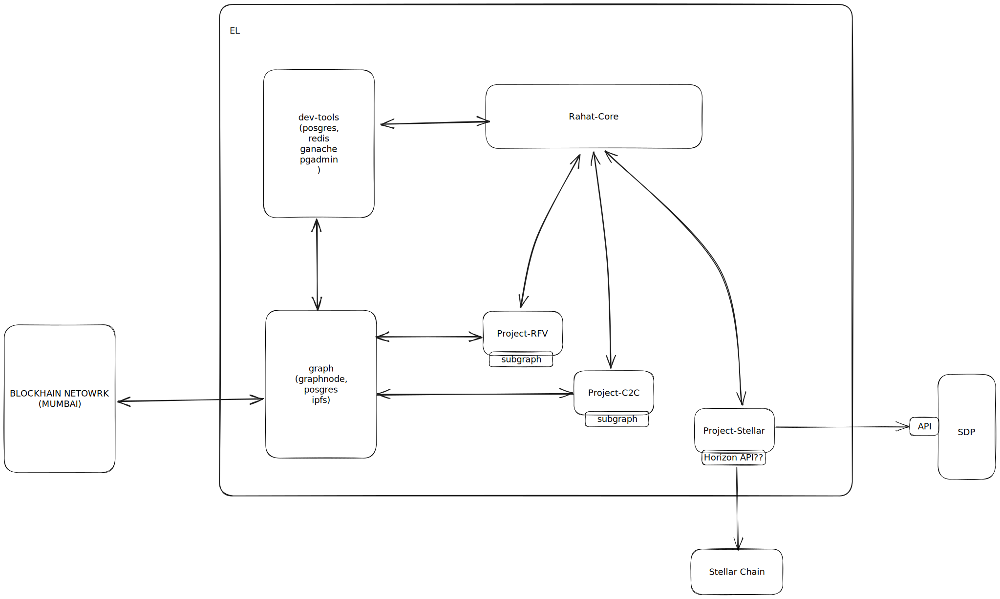

# Stellar

Current CVA Process

1. Assign beenficiaries to projects
2. Assign tokens to beneficiaries
3. Register vendors to projects
4. Vendors can charge beneficiary tokens and give them cash in return after OTP verification

Probable Stellar CVA process (Need to be changed as per the requirement)

1. Setup a new rahat-project with stellar chain integration
2. Create a stellar account for beneficiaries
3. Distribute claimable tokens to beneficiaries, which can later the exchanged with USDC
4. vendors can charge the beneficiary tokens and give them cash in return after OTP verification
5. Vendors can get the USDC from the rahat-project via SDP (Or we can pre-distrbute USDC to vendors)

Rahat projects with stellar integration

